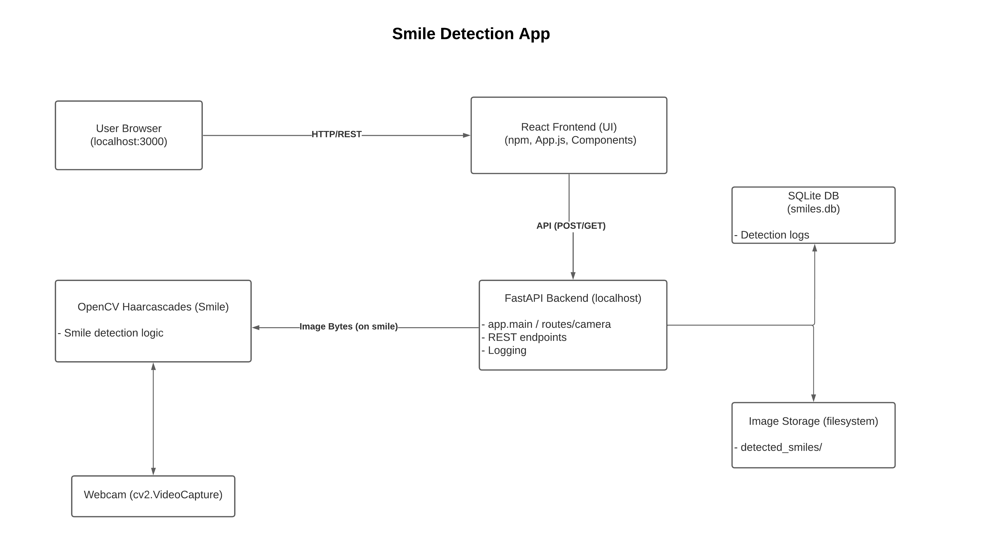
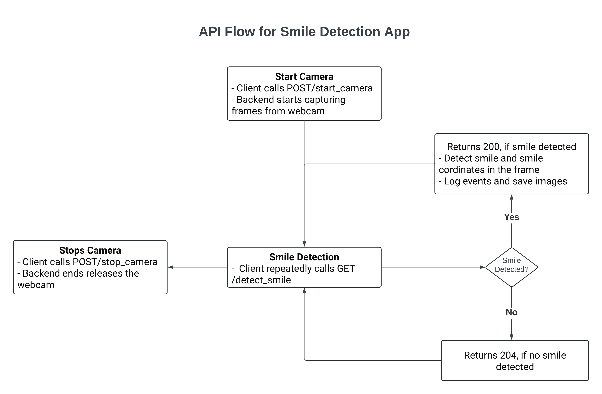

# Smile Detection App

A full-stack web application for real-time smile detection with a React frontend and a Python FastAPI backend.
The app allows users to start and stop smile detection, displays live webcam images with detected smiles, shows bounding box coordinates, and logs detection events with images and metadata.

---

## System Architecture

This project follows a modular, industry-standard architecture for clear separation of frontend, backend, and infrastructure layers:

<p align="center">
  
</p>

- **Frontend (React):** User interface running on `localhost:3000`
- **Backend (FastAPI):** REST API on `localhost:8000`, handling smile detection and business logic
- **OpenCV:** For real-time smile detection from webcam frames
- **SQLite:** For logging smile events and coordinates
- **Image Storage:** Detected smile images saved on the backend

---

## API Flow

Below is a step-by-step overview of the key API endpoints and their flow:

<p align="center">
  
</p>

1. **Start Camera**:

   - Client calls `POST /start_camera`.
   - Backend opens webcam and starts capturing frames.

2. **Smile Detection**:

   - Frontend repeatedly calls `GET /detect_smile`.
   - Backend captures frame, detects smiles, returns a JPEG (with bounding box) and coordinates.
   - If a smile is detected: logs event and saves image; if not, returns `204`.

3. **Stop Camera**:

   - Client calls `POST /stop_camera` to release webcam resources.

4. **Error Handling**:

   - If detection is requested before the camera is started, returns `409 Conflict`.
   - All errors are logged and sent to the client with appropriate HTTP status.

---

## Features

- **Live Smile Detection** via webcam (no cloud dependencies)
- **Frontend:**

  - Modern React (with hooks)
  - Comprehensive Jest + React Testing Library test coverage
  - Responsive, user-friendly UI/UX

- **Backend:**

  - FastAPI, OpenCV for real-time face & smile detection
  - RESTful API with robust error handling
  - SQLite database for detection logs
  - Smile images automatically saved in a local directory
  - Full test suite (pytest, isolated tests)

- **Configurable:**

  - All paths (API, images, DB) can be changed via environment variables

- **API Documentation:**

  - Interactive Swagger UI at `/docs` ([http://localhost:8000/docs](http://localhost:8000/docs))

---

## Project Structure

```
smile-detection-app/
  ├── backend/
  │   ├── app/
  │   ├── detected_smiles/
  │   ├── migrations/
  │   ├── tests/
  │   ├── app.log
  │   ├── smiles.db
  │   ├── ...
  ├── frontend/
  │   ├── src/
  │   ├── public/
  │   ├── ...
  ├── documents/           # Diagrams, screenshots, etc.
  ├── README.md            # This file
```

---

## Prerequisites

> **Please install these tools _before_ running the project.**

### 1. **Python (3.10+)**

- Download from: [python.org](https://www.python.org/downloads/)
- **Note:** Python 3.10 or newer is required.  
  (Check your version: `python --version`)

### 2. **Poetry** (for backend dependency management)

- Install via pip:
  ```bash
  pip install poetry
  ```

````

* Official docs: [python-poetry.org/docs/#installation](https://python-poetry.org/docs/#installation)

### 3. **Node.js (with npm)** (for frontend)

* Download and install from: [nodejs.org](https://nodejs.org/)
* Choose the **LTS version** (Recommended for Most Users).
* After installing, check with:

  ```bash
  node -v
  npm -v
  ```
* **npm** (Node Package Manager) is included with Node.js.

### 4. **A computer with a webcam**

* (Required for real-time smile detection.)

---

## Quick Start

### 1. Clone the Repository

```bash
git clone https://github.com/manushig/smile-detection-app.git
cd smile-detection-app
```

### 2. Backend Setup

```bash
cd backend
poetry install
poetry run uvicorn app.main:app --reload
```

- Backend API runs on [http://localhost:8000](http://localhost:8000)
- Interactive API docs: [http://localhost:8000/docs](http://localhost:8000/docs)

### 3. Frontend Setup

```bash
cd ../frontend
npm install
npm start
```

- React app runs on [http://localhost:3000](http://localhost:3000)

---

## Environment Variables

- **Frontend (`frontend/.env`):**

  ```
  REACT_APP_API_URL=http://localhost:8000
  ```

  (Defaults to `http://localhost:8000` if not set.)

- **Backend (`backend/.env`):**

  ```
  DETECTION_IMAGE_DIR=detected_smiles
  SMILE_DB_PATH=smiles.db
  ```

  (Optional; backend will use defaults if not provided.)

---

## How It Works

### 1. **Start Camera**

- User clicks "Start" in the frontend, which calls `POST /start_camera` on the backend.
- Backend opens the webcam and starts capturing frames in the background.

### 2. **Live Smile Detection**

- Frontend polls `GET /detect_smile` every second.
- Backend grabs the latest frame, detects smiles, draws bounding boxes, and sends:

  - The annotated image (as JPEG)
  - Smile coordinates (in `X-Smile-Coords` response header)

- If a smile is detected, backend logs the event (timestamp, coords) and saves the image.

### 3. **Stop Camera**

- User clicks "Stop," triggering `POST /stop_camera`, which releases the webcam and stops background capture.

### 4. **Error Handling**

- All errors (backend unavailable, camera not started, no smile detected) are handled gracefully and communicated to the user via the frontend.

---

## Running Tests

### **Frontend**

```bash
cd frontend
npm test             # Runs all React/Jest tests
```

### **Backend**

```bash
cd backend
poetry run pytest    # Runs all Pytest unit and integration tests
```

---

## Limitations & References

- **Smile detection is based on OpenCV Haar cascades:**
  Fast, but may produce false positives/negatives in challenging lighting or angles.
  See README in backend for known issues and recommended improvements.

---

## Author

**Manushi**
[GitHub](https://github.com/manushig)
[LinkedIn](https://linkedin.com/in/manushi-g)

---

_For any questions or issues, please open an issue on GitHub or contact the author directly._

---


````
