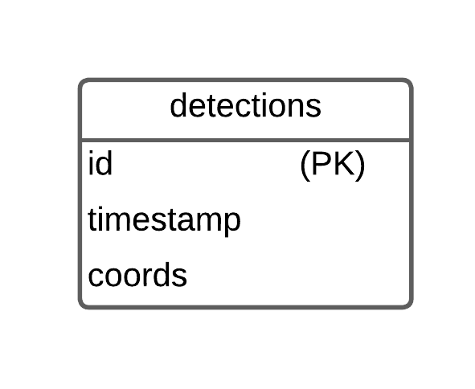

# Smile Detection Backend

A robust FastAPI backend for real-time smile detection using OpenCV.
Captures webcam images, detects smiles, overlays bounding boxes, returns annotated images, and logs each detection event (including saving image files and recording coordinates in SQLite).

---

## Features

- **RESTful API** built with FastAPI
- **Real-time smile detection** with OpenCV Haar cascades
- **Returns JPEG images** with bounding box overlay and smile coordinates in HTTP headers
- **Logs detection events** to a local SQLite database (`smiles.db`)
- **Saves detected smile images** in a configurable folder (`detected_smiles/`)
- **Centralized logging** to console and `app.log`
- **Unit and integration tests** using Pytest, with isolated DB and file tests
- **Configurable paths** for DB and image storage using environment variables

---

## Setup Instructions

### Prerequisites

- Python 3.10+
- [Poetry](https://python-poetry.org/docs/#installation)
- A device with a webcam

### Installation

```bash
cd backend
poetry install
```

### Configuration (Optional)

Override defaults via a `.env` file in `backend/`:

```
DETECTION_IMAGE_DIR=detected_smiles
SMILE_DB_PATH=smiles.db
```

The backend loads these automatically if [python-dotenv](https://pypi.org/project/python-dotenv/) is installed (already included).

---

## Running the Service

Start the development server:

```bash
poetry run uvicorn app.main:app --reload
```

- API runs by default at [http://localhost:8000](http://localhost:8000)
- Interactive docs: [http://localhost:8000/docs](http://localhost:8000/docs)

---

## API Endpoints

- **Health Check:** `GET /`
  Returns API status

- **Start Camera:** `POST /start_camera`
  Starts the webcam for detection

- **Stop Camera:** `POST /stop_camera`
  Releases the webcam and resources

- **Smile Detection:** `GET /detect_smile`
  Captures frame, detects smile, overlays bounding box, returns JPEG image and smile coordinates in `X-Smile-Coords` header

  - `204` if no smile detected or no frame available
  - `409` if camera is not started
  - `500` on internal error

---

## How It Works

1. **Start Camera:**  
   The client calls `POST /start_camera` to begin a webcam session on the backend.  
   The backend opens the webcam and starts capturing frames in the background.

2. **Smile Detection:**  
   The client repeatedly calls `GET /detect_smile` (typically every second).

   - The backend grabs the latest frame from the webcam.
   - It runs OpenCV face and smile detection.
   - If a smile is detected:
     - Draws a bounding box on the image.
     - Returns a JPEG image with smile coordinates in the `X-Smile-Coords` header.
     - Logs the detection event (timestamp and coordinates) to the SQLite database.
     - Saves the detected image in the `detected_smiles/` directory.
   - If no smile is detected, returns `204 No Content`.

3. **Stop Camera:**  
   When the client is done, it calls `POST /stop_camera` to release the webcam and free resources.

4. **Error Handling:**
   - If detection is requested while the camera is not started, `409 Conflict` is returned.
   - All errors are logged and appropriate HTTP status codes are sent.

---

## Database Table Schema

Smile detection events are persisted in `smiles.db` as follows:

| Column    | Type    | Description                         |
| --------- | ------- | ----------------------------------- |
| id        | INTEGER | Primary key (autoincrement)         |
| timestamp | TEXT    | Detection timestamp (ISO 8601)      |
| coords    | TEXT    | Smile bounding box JSON coordinates |

**Example `coords`:**

```json
[{ "x": 42, "y": 70, "w": 36, "h": 20 }]
```

---

## ER Diagram

<p align="center">
  
</p>

---

## Migration Script (Optional)

If you wish to set up or migrate your DB schema manually, use:

**`migrations/001_create_detections_table.sql`:**

```sql
CREATE TABLE IF NOT EXISTS detections (
    id INTEGER PRIMARY KEY AUTOINCREMENT,
    timestamp TEXT NOT NULL,
    coords TEXT NOT NULL
);
```

You can apply this with:

```bash
sqlite3 smiles.db < migrations/001_create_detections_table.sql
```

_Note: The app will auto-create the table if it doesn't exist, but this script is provided for completeness and best practices._

---

## Testing

Run the full suite of unit and integration tests:

```bash
poetry run pytest
```

**Coverage includes:**

- Camera management logic
- API routes and error branches
- Detection event logging and image saving
- Smile detection logic with OpenCV (mocked for speed and isolation)
- Health check endpoint

---

## Project Structure

```
backend/
  ├── app/
  │   ├── main.py                    # FastAPI app entrypoint
  │   ├── logger.py                  # Logging setup
  │   ├── app
  │   │   ├── models/
  │   │   │   └── detection_event.py # SQLite and image-saving utilities
  │   │   ├── routes/
  │   │   │   └── camera.py          # API endpoints (start, stop, detect)
  │   │   ├── services/
  │   │   │   ├── camera_manager.py  # Webcam session/background capture
  │   │   │   └── smile_detector.py  # Smile detection logic (OpenCV)
  ├── detected_smiles/               # Saved smile images
  ├── migrations/                    # Saved migration file
  ├── tests/                         # Pytest unit/integration tests
  ├── .env                           # Backend config (optional)
  ├── app.log                        # Backend log file
  ├── pyproject.toml                 # Poetry config
  ├── README.md                      # This file
  ├── smiles.db                      # Detection logs (SQLite DB)
```

---

## Tech Stack

- **Framework:** FastAPI (Python 3.10+)
- **Computer Vision:** OpenCV
- **Data:** SQLite
- **Logging:** Python `logging` (to console and `app.log`)
- **Testing:** Pytest, FastAPI TestClient, unittest.mock
- **Config:** Environment variables via [python-dotenv](https://pypi.org/project/python-dotenv/)

---

## Notes for Reviewers

- Haar cascade files are included in OpenCV installation—no extra model setup is needed.
- Smile detection is limited by the accuracy of Haar cascades. See "Known Issues" below for details.
- All logs are saved in `backend/app.log`. Detection images are stored in `detected_smiles/`.
- API endpoints and responses are fully documented in the OpenAPI schema ([/docs](http://localhost:8000/docs)).

---

## Known Limitations of Haar Cascade Smile Detection

This project uses OpenCV’s [Haar cascades](https://docs.opencv.org/4.x/db/d28/tutorial_cascade_classifier.html), which are:

- **Fast and require no GPU or cloud**
- But **sensitive to lighting, face angle, and occlusions**
- Can generate false positives (e.g., glasses, mustache) and false negatives (misses subtle smiles)
- For production, consider [MediaPipe Face Landmarker](https://developers.google.com/mediapipe/solutions/vision/face_landmarker), Dlib, or custom-trained deep learning models.

**Filtering Strategies Used:**

- Only detects boxes with width/height > 1.8 and center_y > 60% of face height
- Only the largest smile region per face is considered

---

## Example Output

Detection images and test artifacts can be found in the `detected_smiles/` directory (created automatically).

---

## Author

**Manushi**
[GitHub](https://github.com/manushig)
[LinkedIn](https://linkedin.com/in/manushi-g)

---

**For any issues or feedback, please reach out via GitHub or LinkedIn.**

---
