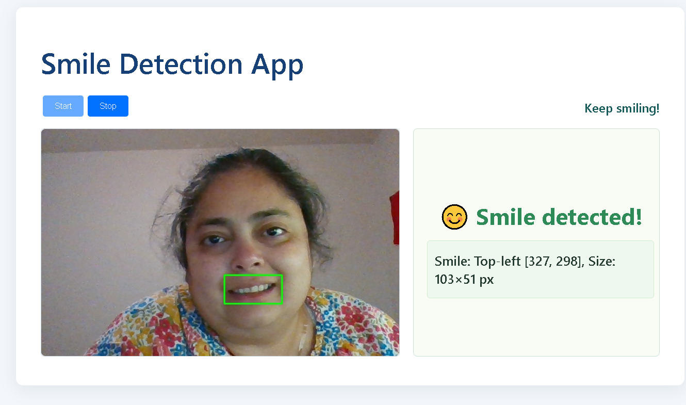

# Smile Detection App – Frontend

A modern, well-tested **React** application for real-time smile detection, designed to integrate with a Python FastAPI backend.
Captures images via webcam (handled by backend), displays detected smiles with bounding boxes, and provides live feedback and detailed detection coordinates.

---

## Features

- **Start/Stop Smile Detection:**
  Intuitive controls to begin or end the detection session.
- **Live Image Display:**
  Shows the most recent frame from the backend with detected smiles highlighted.
- **Smile Coordinates:**
  Displays bounding box coordinates for each detected smile in a clear format.
- **Real-Time Feedback:**
  UI updates every second while detection is running, with live status and results.
- **User-Friendly Error Handling:**
  All errors (backend unavailable, camera not started, no smile detected) are communicated clearly in the UI.
- **Robust Unit & Integration Tests:**
  Comprehensive test coverage for all components and API interactions using Jest and React Testing Library.
- **Accessible, Modern Design:**
  Clean, responsive UI for an optimal reviewer experience.

---

## UI Screenshot

<p align="center">
  
</p>

> _Screenshot of the Smile Detection App in action, showing real-time webcam feed, detected smile bounding box, and region details._

---

## Getting Started

### Prerequisites

- **Node.js** (v18 or higher recommended)
- **npm** (v9 or higher)

### Installation

```bash
cd frontend
npm install
```

### Configure API Endpoint

Set the backend API URL in a `.env` file at the root of `/frontend`:

```env
REACT_APP_API_URL=http://localhost:8000
```

> The app defaults to `http://localhost:8000` if this is not set.

### Running the App

```bash
npm start
```

App runs locally at [http://localhost:3000](http://localhost:3000).

---

## How It Works

1. **Start Camera:**  
   When the user clicks “Start,” the frontend calls `POST /start_camera` on the backend to begin capturing frames from the webcam.

2. **Live Smile Detection:**  
   The app automatically polls `GET /detect_smile` every second.

   - If a smile is detected:
     - The backend sends back an image with a bounding box, plus smile coordinates.
     - The frontend displays the latest image on the left and shows smile region details on the right.
   - If no smile is detected, the UI shows a friendly status message.

3. **Stop Camera:**  
   When the user clicks “Stop,” the frontend calls `POST /stop_camera` to end the webcam session and stop polling for detections.

4. **Robust Error Handling:**  
   All API errors or status changes (e.g., backend not available, camera not started, no smile) are shown clearly in the app.

---

## Testing & Coverage

### Run All Tests

```bash
npm test
```

### Generate Coverage Report

```bash
npx react-scripts test --coverage --watchAll=false
```

> Coverage results are saved in `frontend/coverage/` (open `index.html` for a detailed report).

---

## Project Structure

```
frontend/
  ├── src/
  │   ├── api/                  # API client and tests
  │   │   ├── SmileApi.js
  │   │   ├── SmileApi.test.js
  │   ├── components/
  │   │   ├── SmileDetails.js
  │   │   ├── SmileDetails.test.js
  │   │   ├── SmileViewer.js
  │   │   ├── SmileViewer.test.js
  │   ├── App.js                # Main App UI
  │   ├── App.test.js           # Main integration/UI tests
  │   ├── index.js, index.css   # Main entry point & global styles
  ├── .env                      # Example environment file
  ├── package.json
  ├── README.md                 # This file
```

---

## Tech Stack

- **React** (v18+)
- **Axios** for backend API communication
- **Jest** and **React Testing Library** for comprehensive testing
- **Plain CSS** for styling (see `index.css`)

---

## Author

**Manushi**
[GitHub](https://github.com/manushig) | [LinkedIn](https://linkedin.com/in/manushi-g)

---

_For any questions or issues, please open an issue on GitHub or contact the author directly._

---
